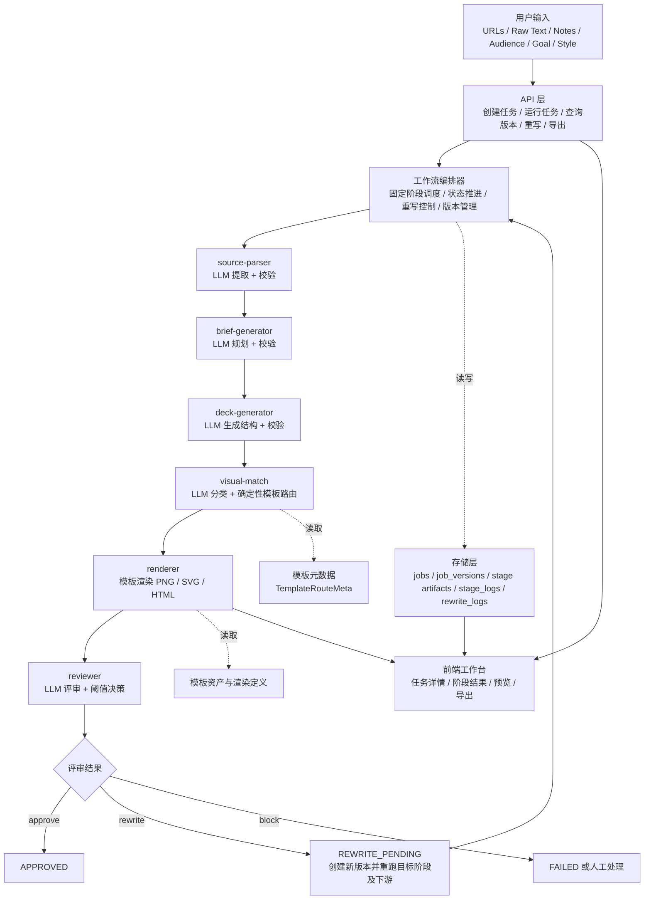

# mid-mint 整体架构

## 架构目标

系统必须在“显式阶段 + 可追踪版本 + LLM 提升内容质量”的前提下，完成从源材料到小红书图文 Deck 的生成闭环。

## 整体架构图

## 分层职责

* API 层负责创建任务、触发运行、查询版本、重写和导出
* 编排层负责固定顺序调度、状态推进、版本管理和失败停止
* 内容生成层负责结构化解析、brief、deck、视觉分类和评审
* 渲染层负责模板渲染和导出资产生成
* 存储层负责任务、版本、阶段产物和审计日志

## 架构约束

* 不允许新增独立 LLM 工作流阶段
* 不允许由模型直接生成正式渲染资产
* 不允许跳过中间阶段直接生成最终结果
* 不允许后续版本覆盖历史版本数据
