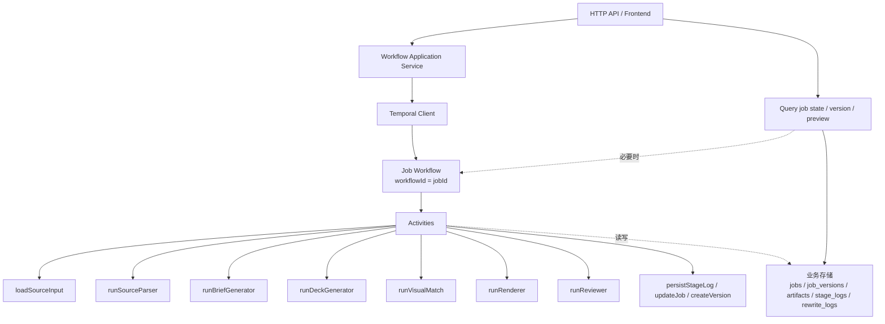

# mid-mint Temporal 迁移设计

## 目标

在不改变现有固定阶段语义的前提下，把当前单进程内编排迁移为可恢复、可查询、可暂停、可重放的 durable workflow。

迁移后必须保留：

* 固定阶段顺序
* 版本化 rewrite
* 阶段级产物落盘
* 阶段执行日志
* review 决策驱动的 approve / rewrite / block

迁移后优先解决：

* 服务进程重启后运行中的 job 丢失
* 多实例下同一 job 并发运行冲突
* 长耗时 LLM / render 步骤缺少可靠恢复
* 后续引入人工审批、异步事件回调时缺少标准挂起能力

## 现状判断

当前编排核心是 [src/modules/workflow/orchestrator.ts](/Users/gengyu/code/mid-mint/src/modules/workflow/orchestrator.ts:153)：

* `run()` 串行执行 `PARSED -> BRIEFED -> DECK_GENERATED -> VISUAL_MATCHED -> RENDERED -> REVIEWED`
* `rewrite()` 通过新版本号加复制上游产物实现定向重跑
* `runStage()` 负责状态推进、日志记录和失败置 `FAILED`
* review 结果决定 `APPROVED / REWRITE_PENDING / FAILED`

当前运行保护主要在 [src/modules/workflow/workflow.service.ts](/Users/gengyu/code/mid-mint/src/modules/workflow/workflow.service.ts:9)：

* `activeRuns` 只在单进程内防重
* API 返回的是“已触发”，不是 durable execution handle

当前存储在 [src/storage/v1-repositories.ts](/Users/gengyu/code/mid-mint/src/storage/v1-repositories.ts:27)：

* job / version / artifact / stage_log / rewrite_log 都是 JSON table
* 适合审计与展示
* 不适合承担 workflow runtime 的恢复与并发控制

结论：

* 现有“阶段定义”和“版本语义”是好的，不需要推倒重来
* 需要替换的是“运行时”
* Temporal 应作为 durable orchestrator
* 现有 repositories 继续作为业务产物与审计存储

## 为什么选 Temporal

Temporal 更适合当前仓库，而不是 agent graph 类框架，原因是：

* 当前主流程是固定阶段流水线，不是动态 agent graph
* rewrite 本质是受控回退后重跑，不是任意图遍历
* 你们最缺的是 durability、resume、single-flight、queryable state
* 这些正好是 Temporal workflow + activity 的强项

不优先选择其他方案的原因：

* `LangGraph` 更适合 agent state graph、复杂人机中断和推理图，不是这个仓库当前的主矛盾
* `BullMQ` 适合补充后台任务，但不足以替代完整 workflow runtime
* `Inngest` 可以作为更轻的备选，但如果编排是核心域模型，Temporal 的边界更清晰

## 迁移原则

* 不改变阶段枚举和对外业务语义
* 不把业务产物存进 Temporal history
* Workflow 只保存最小状态和控制决策
* 大对象产物继续落业务存储
* Activity 保持幂等，可重复执行
* API 层只和 application service 交互，不直接拼 Temporal 细节

## Temporal 目标架构



## 代码映射

### 1. Workflow

新增建议目录：

* `src/temporal/workflows/job.workflow.ts`
* `src/temporal/workflows/types.ts`

核心职责：

* 接收 `jobId`
* 读取当前 `activeVersion`
* 按固定顺序调度阶段 activity
* 根据 review 结果更新终态
* 监听 rewrite / approve / cancel 等 signal
* 提供 query 给 API 查询当前 workflow runtime state

Workflow 内只保存轻量状态：

* `jobId`
* `currentVersion`
* `currentStage`
* `runState`
* `pendingRewrite`
* `lastReviewDecision`
* `lastErrorCode`

不在 Workflow 内保存：

* `ParsedSource`
* `DeckPlan`
* `RenderResult`
* 大段 prompt / SVG / HTML

这些都继续在现有 repositories 里读写。

### 2. Activities

新增建议目录：

* `src/temporal/activities/job.activities.ts`

建议按“阶段 activity + 持久化 activity”拆分：

* `loadJob(jobId)`
* `loadSourceInput(jobId, versionNumber)`
* `runSourceParseStage(jobId, versionNumber)`
* `runBriefStage(jobId, versionNumber)`
* `runDeckStage(jobId, versionNumber)`
* `runVisualStage(jobId, versionNumber)`
* `runRenderStage(jobId, versionNumber)`
* `runReviewStage(jobId, versionNumber)`
* `createRewriteVersion(jobId, targetStage, reason)`
* `finalizeReview(jobId, versionNumber, reviewResult)`
* `getPreview(jobId)`

其中阶段 activity 内部可直接复用现有模块：

* `sourceParser.run`
* `briefGenerator.run`
* `deckGenerator.run`
* `visualMatch.run`
* `renderer.run`
* `reviewer.run`

这样迁移时不需要重写内容生成逻辑，只重写 orchestrator。

### 3. Repository 层

现有 `workflowRepositories` 保留，但职责调整：

* 继续承担 artifact persistence
* 继续承担 job/version/stage_log/rewrite_log 查询
* 不再承担运行时互斥

建议增加两个字段：

* `jobs.workflowId`
* `jobs.runtimeStatus`

`runtimeStatus` 用于区分业务状态和运行态，例如：

* `idle`
* `running`
* `waiting_signal`
* `completed`
* `failed`

这样前端就不会把 `REWRITE_PENDING` 和“workflow 当前是否正在执行”混在一起。

## Workflow 设计

### 主 workflow id

建议：

* `workflowId = jobId`

好处：

* 天然单 job 单主流程
* 可以用 Temporal 自身保证不能重复开启第二条主流程
* API 查询和排障都直观

### Run 模式

一个 job 对应一个长期存在的 workflow execution，负责贯穿：

* initial run
* rewrite run
* 终态完成

而不是“每次 run 都起一个新 workflow”。

原因：

* 你们的核心对象是 `job`
* rewrite 是 job 生命周期内的一次版本推进，不是独立业务实体
* 历史 version 仍存业务库，不需要通过 child workflow 表达

### Signals

建议暴露：

* `requestRewrite(targetStage, reason)`
* `resumeRun()`
* `cancelJob()`

可选：

* `approveManually()`
* `submitHumanReview(payload)`

其中 `requestRewrite` 替代当前同步 `rewriteJob + runJob` 两步组合。

### Queries

建议暴露：

* `getRuntimeState()`
* `getCurrentStage()`
* `getCurrentVersion()`
* `getLastError()`

API 对外仍然可以返回现有结构，但内部可通过 query 获取更准确的 runtime 状态。

## 阶段执行模型

Temporal 中每个阶段建议统一成同一套模式：

1. workflow 调 activity 前先设置内存态 `currentStage`
2. activity 读取上游产物
3. activity 执行业务模块
4. activity 校验输出
5. activity 落业务产物
6. activity 写 `stage_logs`
7. activity 返回轻量结果摘要
8. workflow 决定下一阶段或终态

这意味着现在 [src/modules/workflow/orchestrator.ts](/Users/gengyu/code/mid-mint/src/modules/workflow/orchestrator.ts:374) 里的 `runStage()` 会被拆成两部分：

* workflow 里的阶段调度
* activities 里的持久化与日志

## Rewrite 设计

### 现有语义保留

必须保留当前规则：

* 每次 rewrite 创建新版本
* 只允许从 `source-parse / brief / deck / visual` 起跳
* 上游产物复制，下游重跑
* 最多 3 次

### Temporal 表达方式

1. 用户调用 `POST /api/jobs/:jobId/rewrite`
2. API 不直接改业务状态机，而是发送 `requestRewrite` signal
3. workflow 收到 signal 后调用 `createRewriteVersion` activity
4. activity 完成：
   * 创建 `job_versions`
   * 复制上游 artifacts
   * 记录 `rewrite_logs`
   * 更新 `jobs.activeVersion`
5. workflow 从目标阶段继续执行

这样 rewrite 就变成了 workflow 内的受控状态转换，而不是 API 侧抢改数据库。

## Review 终态设计

`reviewer` 仍输出：

* `approve`
* `rewrite`
* `block`

处理方式：

* `approve`：workflow 更新 job 为 `APPROVED`，execution 完成
* `block`：workflow 更新 job 为 `FAILED`，execution 完成
* `rewrite`：workflow 更新 job 为 `REWRITE_PENDING` 并进入 signal wait

这里和当前实现最大的区别是：

* 现在 `REWRITE_PENDING` 只是业务状态
* 迁移后它同时可以对应一个真实的“等待外部 signal”状态

这会让人工介入、延迟重跑、审批后继续变得自然很多。

## API 适配方案

现有 API 尽量保持不变：

* `POST /api/jobs`
* `POST /api/jobs/:jobId/run`
* `GET /api/jobs/:jobId`
* `GET /api/jobs/:jobId/versions/:version`
* `POST /api/jobs/:jobId/rewrite`
* `GET /api/jobs/:jobId/preview`
* `POST /api/jobs/:jobId/export`

建议的内部行为变化：

### `POST /api/jobs`

保留创建 job 与 version 1。

可选两种模式：

* 继续只创建，不自动启动 workflow
* 创建后立即启动 workflow 并返回 `jobId`

如果保持现状，推荐仍然“不自动启动”。

### `POST /api/jobs/:jobId/run`

当前：直接 `startRun(jobId)`。

迁移后：

* 如果 workflow 不存在：`start`
* 如果 workflow 已在等待 `resumeRun`：发送 signal
* 如果 workflow 正在运行：直接返回当前 runtime 状态

### `POST /api/jobs/:jobId/rewrite`

当前：同步创建下一版本并改 job。

迁移后：

* 发送 `requestRewrite` signal
* 返回“rewrite accepted”
* 真正的 version 创建由 workflow 内 activity 执行

### `GET /api/jobs/:jobId`

建议组合两类数据：

* 业务库 job 信息
* workflow query 返回的 runtime 状态

前端展示上建议拆成：

* `businessStatus`
* `runtimeStatus`

## 失败恢复与幂等

这是迁移里最重要的一部分。

### Activity 幂等要求

所有 activity 都要以 `jobId + versionNumber + stage` 为幂等键。

最低要求：

* 若某阶段产物已存在且校验通过，可直接返回
* 写 `stage_logs` 时允许重复记录，但最好能去重
* 渲染输出目录要能被重复写入或覆盖

### 推荐策略

* `source/brief/deck/visual/review`：优先“有产物即短路返回”
* `render`：输出写入固定版本目录，允许覆盖
* `createRewriteVersion`：需要显式防重复，避免 signal 重放导致版本号跳两次

建议给 `job_versions` 增加一条约束语义：

* 同一 `jobId + versionNumber` 只能存在一条记录

即便底层暂时还是 JSON table，也要在 repository 层加显式检查。

## 推荐目录结构

```text
src/
  temporal/
    client.ts
    worker.ts
    workflows/
      job.workflow.ts
      types.ts
    activities/
      job.activities.ts
      stage.activities.ts
  modules/
    workflow/
      workflow.service.ts
      workflow.repositories.ts
      workflow.types.ts
```

其中：

* `workflow.service.ts` 保留为 application facade
* `orchestrator.ts` 逐步退役
* 业务 stage modules 不动

## 迁移步骤

### Phase 0：先收口现有边界

目标：

* 把现有 `WorkflowOrchestrator` 的阶段调用封装成可复用 activity 风格函数
* 不改外部 API

动作：

* 提炼每个 stage 的输入装配逻辑
* 提炼 `finalizeReview`
* 提炼 `copyRewriteArtifacts`

### Phase 1：引入 Temporal 基础设施

目标：

* 跑通 Temporal worker
* 新建 `JobWorkflow`
* 用最小 POC 跑完整初次执行

动作：

* 加 Temporal TS SDK
* 增加 `client.ts` 和 `worker.ts`
* 新建 `job.workflow.ts`
* 把 `run()` 主链路迁入 workflow + activities

### Phase 2：接入 rewrite signal

目标：

* 支持 `REWRITE_PENDING -> signal -> 新版本 -> 下游重跑`

动作：

* 增加 `requestRewrite` signal
* 将 `rewriteJob` 改成 signal 发送
* 把版本创建和产物复制迁入 activity

### Phase 3：接入 query 与运行态

目标：

* API 能看到 workflow 实时状态

动作：

* 增加 workflow query
* `GET /jobs/:id` 组合 runtime 状态
* 前端区分业务状态和运行状态

### Phase 4：删除旧 orchestrator 主路径

目标：

* 只保留 Temporal 路径

动作：

* `orchestrator.ts` 下线为兼容层或删除
* 移除 `activeRuns`

## 最小可行迁移范围

第一版不建议一次性做完全部能力，建议只做：

* initial run 的 Temporal 化
* query 当前 stage
* 失败可恢复
* 保留现有 artifacts 和 preview 能力

第一版暂不做：

* 人工 review signal
* cancel / terminate
* child workflow
* 多队列隔离
* 数据库替换

## 风险与注意点

### 1. Workflow history 过大

如果把大产物直接放进 workflow 返回值或 signal payload，会很快膨胀。

约束：

* workflow / signal / query 只传轻量结构
* 大对象始终走 repository

### 2. Activity 重放副作用

Temporal 会重试 activity，所以副作用必须幂等。

重点检查：

* 版本创建
* stage log 写入
* render 文件输出

### 3. 现有 JSON 存储不是强事务

Temporal 解决的是 runtime durability，不自动解决业务存储事务一致性。

短期接受：

* 先保留 JSON storage

中期建议：

* 把 job / version / stage_log 迁到真正数据库

### 4. 前端状态认知会变化

当前前端把 `job.status` 近似当成“正在跑到哪一步”。

迁移后更合理的模型是：

* `job.status` 表示业务阶段结果
* `runtimeStatus` 表示执行态
* `currentStage` 表示 workflow 正在执行的 stage

## 建议先做的 POC

POC 成功标准：

* 创建 job 后能启动 Temporal workflow
* workflow 能依次执行到 `REVIEWED`
* 服务进程重启后仍能继续或查询到状态
* 同一个 `jobId` 不会并发跑两条主流程

POC 范围：

* 只接 `POST /jobs/:jobId/run`
* 暂不迁 `rewrite`
* 暂不改前端协议

## 最终建议

这次迁移不该被理解成“换个框架”，而是：

* 保留现有业务阶段模型
* 把 orchestrator 替换为 durable runtime
* 让 rewrite、等待、恢复、并发控制都从手写状态机转成基础设施能力

如果要正式开工，建议按顺序拆成 4 个开发任务：

1. 提炼 stage activities，减少 `orchestrator.ts` 内联逻辑
2. 接入 Temporal，先跑 initial run
3. 接入 rewrite signal 和 query
4. 前端补 runtimeStatus 展示并下线旧 orchestrator
